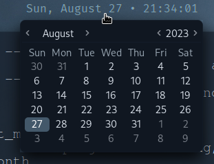

# ocean-dark rice
This rice is using my custom color pallet called `ocean-dark`. \
Wallpaper: https://unsplash.com/photos/mhS1fcL396w

Fonts needed:
```
FiraCode Nerd Font
FiraCode Nerd Font Mono
```

Install it via the [AUR](https://security.archlinux.org/package/ttf-firacode-nerd) using your favorite AUR helper. \
Ex. `yay`: 
```sh
$ yay -S ttf-firacode-nerd
```

There are a shit load of other dependencies needed, I'll update this README later on as the rice isn't fully done. \
This rice is for Arch.

To be added:
- [ ] lunarvim theme
- [x] finish up the bar n shit
- [ ] rice ranger and another file manager (debating on which one)
- [ ] any other shit I feel like.

**Join the church!** \
https://thcotd.org

## Screenies (outdated, wifi module added to the bar):



 
